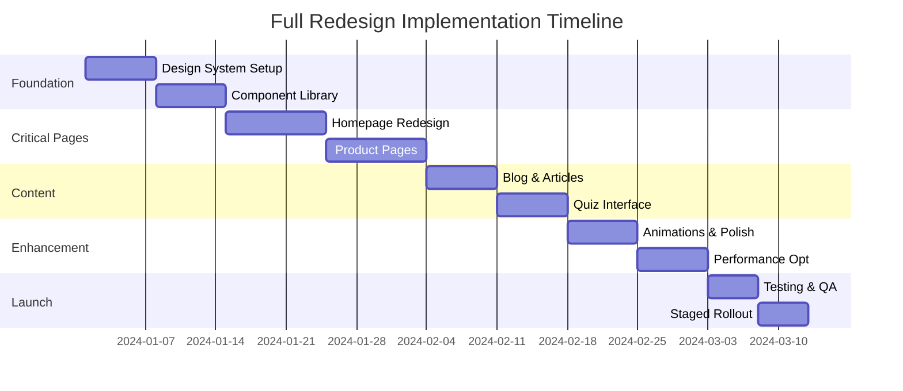

# Phased Rollout Plan - Full Site Redesign

## Executive Summary

This document outlines a strategic 10-week phased approach to implement the full redesign of BigShine Display, ensuring minimal disruption while maximizing impact. Each phase builds upon the previous, with built-in testing and optimization periods.

---

## Phase Timeline Overview



---

## Phase 1: Foundation Setup (Weeks 1-2)

### Week 1: Design System Infrastructure

#### Tasks
1. **Update Global Variables**
   ```scss
   // Update src/styles/variables.scss
   - Implement new color palette
   - Add gradient definitions
   - Update spacing scale
   - Define animation timings
   ```

2. **Typography System**
   ```scss
   // Update src/styles/typography.scss
   - Implement fluid type scale
   - Add font loading strategy
   - Define heading hierarchies
   ```

3. **Create Base Components**
   - Button system with all variants
   - Card components
   - Form elements
   - Loading states

#### Deliverables
- [ ] Updated SCSS architecture
- [ ] Component storybook
- [ ] Design tokens documentation
- [ ] Initial performance baseline

### Week 2: Component Library Completion

#### Tasks
1. **Complex Components**
   - Navigation with mega menu
   - Product cards with interactions
   - Modal system
   - Toast notifications

2. **Testing Infrastructure**
   - Unit tests for components
   - Visual regression tests
   - Accessibility audits
   - Browser compatibility checks

3. **Documentation**
   - Component usage guide
   - Migration notes for developers
   - Design system website

#### Quality Gates
- All components pass accessibility audit
- Performance budget maintained
- Cross-browser compatibility verified
- Documentation reviewed and approved

---

## Phase 2: Critical Pages (Weeks 3-4)

### Week 3: Homepage Transformation

#### Implementation Steps
1. **Hero Section**
   - Implement video background
   - Add gradient overlays
   - Create animated CTAs
   - Mobile optimization

2. **Feature Sections**
   - Problem/solution layout
   - Product showcase grid
   - Interactive demo area
   - Use case tabs

3. **Social Proof**
   - Testimonial carousel
   - Client logo grid
   - Trust signals

#### A/B Testing Setup
```javascript
// Variants to test
const heroVariants = {
  A: { cta: "Explore Solutions", video: true },
  B: { cta: "See Our Products", video: false }
};

const productGridVariants = {
  A: { columns: 3, showPrices: true },
  B: { columns: 4, showPrices: false }
};
```

### Week 4: Product Pages Overhaul

#### Category Pages
1. **Filter System**
   - Advanced filtering UI
   - Real-time updates
   - Mobile filter drawer
   - Filter persistence

2. **Product Grid**
   - Enhanced product cards
   - Quick view functionality
   - Comparison tools
   - Lazy loading

#### Detail Pages
1. **Product Gallery**
   - Zoom functionality
   - Video integration
   - 360° views (if available)
   - Mobile swipe gestures

2. **Information Architecture**
   - Tabbed content
   - Sticky purchase panel
   - Related products
   - Reviews integration

---

## Phase 3: Content Pages (Weeks 5-6)

### Week 5: Blog & Article Redesign

#### Blog Listing
1. **Layout Options**
   - Magazine-style grid
   - Featured post hero
   - Category filtering
   - Search integration

2. **Article Template**
   - Readable typography
   - Table of contents
   - Social sharing
   - Related articles

### Week 6: Interactive Features

#### Quiz Interface
1. **Question Flow**
   - Progress indicators
   - Smooth transitions
   - Answer validation
   - Save progress

2. **Results Page**
   - Personalized recommendations
   - Email capture
   - Social sharing
   - PDF download

#### Contact & Forms
1. **Contact Page**
   - Interactive map
   - Department selector
   - Live chat integration
   - Office locations

2. **Quote Request**
   - Multi-step form
   - File uploads
   - Real-time validation
   - Progress saving

---

## Phase 4: Enhancement & Polish (Weeks 7-8)

### Week 7: Animation & Interactions

#### Micro-interactions
```javascript
// Implement throughout site
- Button hover effects
- Card lift animations
- Smooth scrolling
- Parallax effects
- Loading animations
- Page transitions
```

#### Performance Optimizations
1. **Image Optimization**
   - Implement lazy loading
   - Use next-gen formats
   - Responsive images
   - CDN integration

2. **Code Optimization**
   - Tree shaking
   - Code splitting
   - CSS purging
   - JavaScript minification

### Week 8: Cross-Device Testing

#### Testing Matrix
| Device | Browser | Priority | Status |
|--------|---------|----------|---------|
| iPhone 12+ | Safari | High | Pending |
| Samsung Galaxy | Chrome | High | Pending |
| iPad Pro | Safari | Medium | Pending |
| Desktop | Chrome/Firefox/Edge | High | Pending |

#### Performance Targets
- Lighthouse Score: 90+
- First Contentful Paint: <1.5s
- Time to Interactive: <3.5s
- Cumulative Layout Shift: <0.1

---

## Phase 5: Launch Preparation (Weeks 9-10)

### Week 9: Quality Assurance

#### Testing Checklist
- [ ] Functional testing (all features)
- [ ] Cross-browser compatibility
- [ ] Mobile responsiveness
- [ ] Accessibility compliance
- [ ] Performance benchmarks
- [ ] SEO validation
- [ ] Analytics tracking
- [ ] Form submissions
- [ ] Error handling
- [ ] 404 pages

#### Bug Tracking
```markdown
## Bug Template
**Severity**: Critical | High | Medium | Low
**Page**: [URL]
**Description**: [What's wrong]
**Steps to Reproduce**: [How to see it]
**Expected**: [What should happen]
**Actual**: [What happens]
**Browser/Device**: [Where it happens]
```

### Week 10: Staged Rollout

#### Rollout Strategy
1. **Stage 1: Internal Testing (Day 1-2)**
   - Team review
   - Stakeholder feedback
   - Final adjustments

2. **Stage 2: Beta Users (Day 3-4)**
   - Select customer group
   - Feedback collection
   - Performance monitoring

3. **Stage 3: Gradual Release (Day 5-7)**
   - 10% traffic → New design
   - Monitor metrics
   - Adjust based on data

4. **Stage 4: Full Launch (Day 8+)**
   - 100% traffic to new design
   - Announcement campaign
   - Support team briefing

---

## Risk Mitigation

### Rollback Plan
```bash
# Quick rollback procedure
1. Switch load balancer to previous version
2. Clear CDN cache
3. Notify team via Slack
4. Document issues for post-mortem
```

### Contingency Measures
| Risk | Likelihood | Impact | Mitigation |
|------|------------|---------|------------|
| Performance regression | Medium | High | Continuous monitoring, optimization budget |
| Browser incompatibility | Low | Medium | Extensive testing, polyfills ready |
| SEO ranking drop | Low | High | 301 redirects, sitemap updates |
| High bounce rate | Medium | Medium | A/B testing, quick iterations |

---

## Success Metrics

### Week-by-Week KPIs
| Week | Focus | Success Criteria |
|------|-------|------------------|
| 1-2 | Foundation | Component library 100% complete |
| 3-4 | Critical Pages | Homepage & products redesigned |
| 5-6 | Content | All templates updated |
| 7-8 | Enhancement | Performance targets met |
| 9-10 | Launch | Successful rollout, <2% error rate |

### Post-Launch Monitoring (30 days)
1. **User Metrics**
   - Bounce rate: Target -20%
   - Session duration: Target +30%
   - Pages per session: Target +25%

2. **Business Metrics**
   - Lead generation: Target +35%
   - Quote requests: Target +30%
   - Demo bookings: Target +25%

3. **Technical Metrics**
   - Page load time: <3s
   - Error rate: <1%
   - Uptime: 99.9%

---

## Team Responsibilities

### RACI Matrix
| Task | Frontend Dev | Designer | PM | QA |
|------|--------------|----------|----|----|
| Design System | R | C | I | I |
| Component Dev | R | C | A | C |
| Page Implementation | R | I | A | C |
| Testing | C | I | I | R |
| Launch | C | I | R | A |

**R**: Responsible, **A**: Accountable, **C**: Consulted, **I**: Informed

---

## Communication Plan

### Daily Standups
- 15-minute sync
- Blockers discussion
- Progress updates
- Next 24h priorities

### Weekly Reviews
- Phase progress
- Metrics review
- Risk assessment
- Stakeholder updates

### Launch Communications
1. **Internal**: All-hands announcement
2. **Customers**: Email campaign
3. **Social**: Launch posts
4. **Press**: Media kit ready

---

This phased rollout plan ensures a systematic, low-risk approach to implementing the full redesign while maintaining flexibility to adjust based on real-world feedback and metrics.