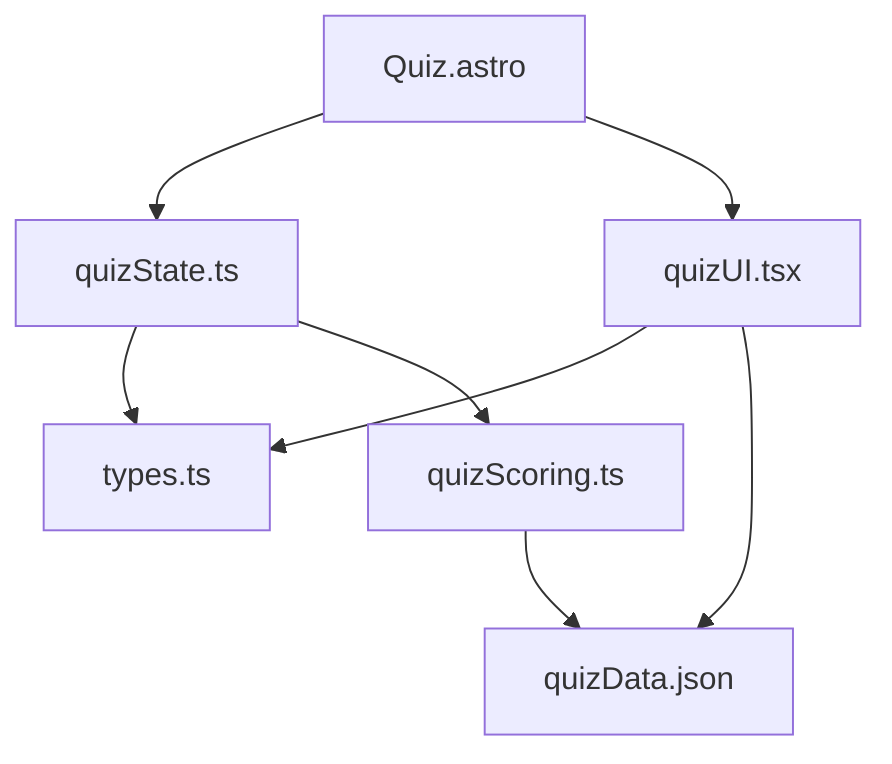

# AI Development Infrastructure Guide

> **Last Updated**: 2025-06-03  
> **Status**: Draft  
> **Author**: Cascade AI

## Overview

This document outlines recommended infrastructure for integrating AI agents into the BigShine Display development workflow. These recommendations build upon the existing feature-based work item system to create a more efficient AI-assisted development process.

## Table of Contents

1. [Structured Data for AI Consumption](#structured-data-for-ai-consumption)
2. [Context Management System](#context-management-system)
3. [Self-Updating Documentation](#self-updating-documentation)
4. [AI Feedback Loops](#ai-feedback-loops)
5. [Testing Infrastructure](#testing-infrastructure)
6. [Integration Points](#integration-points)
7. [Implementation Roadmap](#implementation-roadmap)

## Structured Data for AI Consumption

### Schema Definition Files

```typescript
// /dev/src/project-management/schemas/workItem.schema.json
{
  "$schema": "http://json-schema.org/draft-07/schema#",
  "type": "object",
  "required": ["id", "name", "status", "priority", "files", "details", "criteria"],
  "properties": {
    "id": {
      "type": "string",
      "pattern": "^WI-\\d{3}$"
    },
    "name": {
      "type": "string",
      "minLength": 5,
      "maxLength": 100
    },
    "status": {
      "type": "string",
      "enum": ["Not Started", "In Progress", "Completed", "Needs Review", "Blocked"]
    },
    // Additional properties...
  }
}
```

### Validation Tools

Implement simple validation scripts that ensure all work items follow the required format:

```javascript
// Example validation script concept
function validateWorkItems(featureFilePath) {
  const featureContent = fs.readFileSync(featureFilePath, 'utf8');
  const workItems = parseWorkItemsFromMarkdown(featureContent);
  
  return workItems.map(item => {
    const validationResult = validateAgainstSchema(item, workItemSchema);
    return {
      id: item.id,
      isValid: validationResult.valid,
      errors: validationResult.errors
    };
  });
}
```

### Metadata Enrichment

Enhance work items with additional contextual metadata to improve AI understanding:

- **Component Relationships**: Explicitly document how components relate to each other
- **Complexity Estimates**: Add T-shirt sizing (S/M/L/XL) for implementation complexity
- **Technology Tags**: Specify what technologies are used in each work item

## Context Management System

### Codebase Maps

Create documentation that outlines key architectural relationships:

```markdown
# Component Relationship Map

## Quiz Feature

- **Quiz.astro** → Entry point, handles rendering and client script loading
  - **quizState.ts** → State management for the quiz
  - **quizScoring.ts** → Scoring logic and algorithms
  - **quizUI.tsx** → UI components for questions and results
  - **quizData.json** → Question and result data
```

### Dependency Graphs

Visualize component dependencies to help AI understand the codebase structure:



### Pattern Libraries

Document common coding patterns used in the project that AI should follow:

```typescript
// Example pattern: Functional component with typed props
interface ButtonProps {
  text: string;
  onClick: () => void;
  variant?: 'primary' | 'secondary' | 'ghost';
  isDisabled?: boolean;
}

function Button({
  text,
  onClick,
  variant = 'primary',
  isDisabled = false
}: ButtonProps) {
  return (
    <button
      className={`button button--${variant} ${isDisabled ? 'button--disabled' : ''}`}
      onClick={onClick}
      disabled={isDisabled}
    >
      {text}
    </button>
  );
}
```

## Self-Updating Documentation

### Component Registry

Create an auto-updating registry of all components with their props and usage examples:

```typescript
// ComponentRegistry.ts
interface ComponentMeta {
  name: string;
  description: string;
  props: PropMeta[];
  exampleUsage: string;
  filepath: string;
}

interface PropMeta {
  name: string;
  type: string;
  isRequired: boolean;
  defaultValue?: string;
  description: string;
}

// This registry would be automatically populated through code analysis
const componentRegistry: Record<string, ComponentMeta> = {};
```

### Inline Documentation Generation

Implement workflows that analyze code and generate/update JSDoc comments:

```typescript
/**
 * Calculates quiz results based on weighted answers
 * @param {Answer[]} answers - Array of user answers with their weights
 * @param {SetupOption[]} availableSetups - Available product setups to match
 * @returns {RecommendedSetup[]} Sorted array of recommended setups
 * @autogenerated Updated 2025-06-03
 */
function calculateResults(answers, availableSetups) {
  // Implementation...
}
```

### Changelog Automation

Set up automated generation of changelog entries based on code changes:

```markdown
# Changelog

## [Unreleased]

### Added
- WI-001: Weighted question scoring with normalization (by Cascade AI)
- WI-016: Refactored quiz state management (by Cascade AI)

### Changed
- Improved quiz result display with product images
- Enhanced question flow with better transitions

### Fixed
- Issue with quiz restart not clearing previous answers
```

## AI Feedback Loops

### Implementation Quality Checks

Create automated evaluation of AI-generated code against project standards:

```typescript
// Example quality check script concept
function evaluateImplementation(workItemId, changedFiles) {
  const results = {
    styleGuideCompliance: runStyleCheck(changedFiles),
    typeCompleteness: calculateTypeConverage(changedFiles),
    testCoverage: analyzeTestCoverage(changedFiles),
    accessibility: runA11yChecks(changedFiles)
  };
  
  logQualityResults(workItemId, results);
  return results;
}
```

### Solution Pattern Recording

Document successful AI implementation approaches for reuse:

```markdown
# AI Solution Pattern: State Management with useReducer

## Problem Pattern
Managing complex state with multiple interdependent values and transitions.

## Solution Pattern
Implement with useReducer pattern:
1. Define state interface
2. Create action types and action creators
3. Implement reducer function with exhaustive type checking
4. Use React.useReducer hook with initial state

## Example Implementation
See: `/dev/src/components/quiz/quizState.ts`
```

### Failure Analysis

Track where AI struggles and create specialized guides for those scenarios:

```markdown
# AI Implementation Challenges

## Challenge: Complex CSS Animations
AI struggles with implementing complex animations that involve multiple keyframes and timing functions.

### Mitigation Strategy
- Provide detailed animation specifications with keyframe percentages
- Include reference animations when possible
- Break down complex animations into smaller, composable parts
```

## Testing Infrastructure

### Acceptance Testing Templates

Create pre-defined tests based on work item acceptance criteria:

```typescript
// Example: Auto-generated test based on acceptance criteria
describe('WI-001: Weighted Question Scoring', () => {
  it('applies correct weights to questions based on importance factors', () => {
    // Test code auto-generated from acceptance criteria
  });
  
  it('normalizes scores to maintain consistent scale regardless of questions answered', () => {
    // Test code auto-generated from acceptance criteria
  });
  
  it('correctly breaks ties between similarly scored products', () => {
    // Test code auto-generated from acceptance criteria
  });
});
```

### Visual Regression Testing

Implement visual testing especially for UI components:

```javascript
// Example visual regression test concept
describe('Quiz Results UI', () => {
  it('displays correctly with one result', async () => {
    await page.goto('/quiz');
    // Complete quiz with specific answers...
    await expect(page).toMatchSnapshot('single-result.png');
  });
  
  it('displays correctly with multiple results', async () => {
    await page.goto('/quiz');
    // Complete quiz with different answers...
    await expect(page).toMatchSnapshot('multiple-results.png');
  });
});
```

### Type Coverage Analysis

Ensure AI-generated code maintains strong typing:

```typescript
// Type coverage report concept
interface TypeCoverageReport {
  filePath: string;
  coverage: number; // percentage
  anyCount: number;
  implicitAnyCount: number;
  nonNullAssertions: number;
  recommendations: string[];
}

// Example output:
// {
//   filePath: '/dev/src/components/quiz/quizState.ts',
//   coverage: 98.5,
//   anyCount: 0,
//   implicitAnyCount: 1,
//   nonNullAssertions: 2,
//   recommendations: ['Add explicit type to variable data on line 42']
// }
```

## Integration Points

### IDE Extensions

Create custom plugins that pull task details directly into your editor:

```json
// .vscode/extensions.json
{
  "recommendations": [
    "bigshine-display.task-explorer"
  ]
}
```

### CLI Tools

Develop command-line interfaces to interact with your project management system:

```bash
# Example CLI commands
$ bs-task list --status="Not Started" --priority="Critical"
$ bs-task assign WI-003 --to="Developer Name"
$ bs-task update WI-001 --status="Completed"
$ bs-task generate-from feature.md
```

### Git Hooks

Implement automated validation of commit messages against work item IDs:

```bash
#!/bin/sh
# .git/hooks/commit-msg

commit_msg=$(cat "$1")
work_item_pattern="WI-[0-9]{3}"

if ! echo "$commit_msg" | grep -E "$work_item_pattern" > /dev/null; then
  echo "Error: Commit message must reference a work item (e.g., WI-001)"
  exit 1
fi
```

## Implementation Roadmap

### Phase 1: Foundation (2-4 weeks)

1. Formalize work item schema definitions
2. Create validation tools for work items
3. Document codebase architecture and patterns
4. Set up basic quality checking tools

### Phase 2: AI Integration (4-6 weeks)

1. Develop workflow files for common AI tasks
2. Create component registry system
3. Implement automated documentation generation
4. Establish acceptance test templates

### Phase 3: Advanced Features (6-8 weeks)

1. Build IDE integration tools
2. Develop CLI for task management
3. Implement git hooks and automation
4. Create comprehensive solution pattern library

### Phase 4: Optimization (Ongoing)

1. Regularly update pattern libraries
2. Analyze AI performance metrics
3. Refine prompts and workflows
4. Expand test coverage

## Conclusion

This infrastructure will create a more structured environment for AI-assisted development on the BigShine Display project. By implementing these recommendations incrementally, you'll establish a robust system that makes AI collaboration more effective and maintainable.
